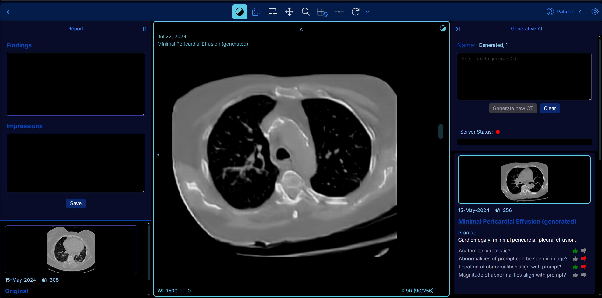

<!-- prettier-ignore-start -->
<!-- markdownlint-disable -->
<div align="center">
  <h1>A Generative AI Extension for the OHIF Viewer</h1>
  <p>This Repository contains the <strong>OHIF Viewer</strong> with an <strong>Generative AI </strong> extension, that enables the user to input a text and ganerates a CT scan of the chest. The OHIF Viewer is a medical image viewer
provided by the <a href="https://ohif.org/">Open Health Imaging Foundation (OHIF)</a>.  This extension requires an backend server to run the generative AI model (MedSyn) to convert text input into 3D CT scans.</p>
</div>

<hr />

<!-- prettier-ignore-end -->


 

Screenshot of Generative AI extension. Left: Findings and Impressions of original CT scan. Right: Enter prompt to generate CT and server Status, below already generated images.


## Developing
### Requirements

- [Yarn 1.17.3+](https://yarnpkg.com/en/docs/install)
- [Node 18+](https://nodejs.org/en/)
- [Docker](https://docs.docker.com/get-docker/)
- Yarn Workspaces should be enabled on your machine:
  - `yarn config set workspaces-experimental true`
- To make inference with MedSyn model GPU with 40GB RAM required


### Getting Started
#### Run Application
1. Clone this repository
   - `git clone https://github.com/TomWartm/Viewers.git`
2. Navigate to the cloned project's directory
3. `yarn install` to restore dependencies and link projects
4. Start backend server `yarn orthanc:up`
5. Start the Application with Orthanc as backend `yarn dev:orthanc` (in a new terminal)

#### Run Backend
1. Clone the backend repository (on a machine with large GPU RAM)
    - `git clone https://github.com/TomWartm/MedsynBackend`
2. Navigate to the cloned project's directory
3. Install required python packages `conda env create --file environment.yml`
4. Activate environment `conda activate medsyn-3-8`
5. Navigate to src folder
6. Run flask server `python app.py`

#### Notes about Backend
- Always shelve the VM when you are done using it
- Don't release the Public IP Address
- Open the web desktop to activate conda environment in the terminal (only need to start from step 4)

#### Add dummy Data
Add NIfTI files to the folder `data/nifti` (some are available on our google drive) and use the notebook in `backend/nifti_to_orthan.ipynb` to converti files into DICOM and upload to the Orthanc server.

#### Pinging the Model API on PSC
* RunMedSyn.ipnyb in this folder: [https://drive.google.com/drive/u/0/folders/1BW8n9D_nBhsLVCdVsN52JaO72Ky23AdI](https://drive.google.com/drive/u/0/folders/1cnKxtEfCOsOYPCQ2xxBLiIYqnj-2ipZR)
* You need the whole folder on PSC 


## Project

The OHIF Medical Image Viewing Platform is maintained as a
[`monorepo`][monorepo]. This means that this repository, instead of containing a
single project, contains many projects. If you explore our project structure,
you'll see the following:

```bash
.
├── extensions               #
│   ├── _example             # Skeleton of example extension
│   ├── default              # basic set of useful functionalities (datasources, panels, etc)
│   ├── cornerstone       # image rendering and tools w/ Cornerstone3D
│   ├── cornerstone-dicom-sr # DICOM Structured Report rendering and export
│   ├── cornerstone-dicom-sr # DICOM Structured Report rendering and export
│   ├── cornerstone-dicom-seg # DICOM Segmentation rendering and export
│   ├── cornerstone-dicom-rt # DICOM RTSTRUCT rendering
│   ├── cornerstone-microscopy # Whole Slide Microscopy rendering
│   ├── dicom-pdf # PDF rendering
│   ├── dicom-video # DICOM RESTful Services
│   ├── measurement-tracking # Longitudinal measurement tracking
|   ├── text-input-extension # generative ML model promting
│   ├── tmtv # Total Metabolic Tumor Volume (TMTV) calculation
|

│
├── modes                    #
│   ├── _example             # Skeleton of example mode
│   ├── generative-ai       # generative ML model promting
│   ├── basic-dev-mode       # Basic development mode
│   ├── longitudinal         # Longitudinal mode (measurement tracking)
│   ├── tmtv       # Total Metabolic Tumor Volume (TMTV) calculation mode
│   └── microscopy          # Whole Slide Microscopy mode
│
├── platform                 #
│   ├── core                 # Business Logic
│   ├── i18n                 # Internationalization Support
│   ├── ui                   # React component library
│   ├── docs                 # Documentation
│   └── viewer               # Connects platform and extension projects
│
├── ...                      # misc. shared configuration
├── lerna.json               # MonoRepo (Lerna) settings
├── package.json             # Shared devDependencies and commands
└── README.md                # This file
```

## Howto
### Manually load images
To manually load images into the Tool you can drag-and-drop with the Upload feature on the study overview page, opload directly to Orthanc server on its interface (`http://localhost:8042/app/explorer.html`) or programmatically with python (check `backend/nifti_to_orthanc.ipynb`)

## Backend
Images are stored on a the Orthanc server you can open up the Interface running on `http://localhost:8042/app/explorer.html`. 

## License
[![MIT License][license-image]][license-url]


<!--
  Links
  -->

<!-- prettier-ignore-start -->
<!-- Badges -->
[lerna-image]: https://img.shields.io/badge/maintained%20with-lerna-cc00ff.svg
[lerna-url]: https://lerna.js.org/
[netlify-image]: https://api.netlify.com/api/v1/badges/32708787-c9b0-4634-b50f-7ca41952da77/deploy-status
[netlify-url]: https://app.netlify.com/sites/ohif-dev/deploys
[all-contributors-image]: https://img.shields.io/badge/all_contributors-0-orange.svg?style=flat-square
[circleci-image]: https://circleci.com/gh/OHIF/Viewers.svg?style=svg
[circleci-url]: https://circleci.com/gh/OHIF/Viewers
[codecov-image]: https://codecov.io/gh/OHIF/Viewers/branch/master/graph/badge.svg
[codecov-url]: https://codecov.io/gh/OHIF/Viewers/branch/master
[prettier-image]: https://img.shields.io/badge/code_style-prettier-ff69b4.svg?style=flat-square
[prettier-url]: https://github.com/prettier/prettier
[semantic-image]: https://img.shields.io/badge/%20%20%F0%9F%93%A6%F0%9F%9A%80-semantic--release-e10079.svg
[semantic-url]: https://github.com/semantic-release/semantic-release
<!-- ROW -->
[npm-url]: https://npmjs.org/package/@ohif/app
[npm-downloads-image]: https://img.shields.io/npm/dm/@ohif/app.svg?style=flat-square
[npm-version-image]: https://img.shields.io/npm/v/@ohif/app.svg?style=flat-square
[docker-pulls-img]: https://img.shields.io/docker/pulls/ohif/viewer.svg?style=flat-square
[docker-image-url]: https://hub.docker.com/r/ohif/app
[license-image]: https://img.shields.io/badge/license-MIT-blue.svg?style=flat-square
[license-url]: LICENSE
[percy-image]: https://percy.io/static/images/percy-badge.svg
[percy-url]: https://percy.io/Open-Health-Imaging-Foundation/OHIF-Viewer
<!-- Links -->
[monorepo]: https://en.wikipedia.org/wiki/Monorepo
[how-to-fork]: https://help.github.com/en/articles/fork-a-repo
[how-to-clone]: https://help.github.com/en/articles/fork-a-repo#step-2-create-a-local-clone-of-your-fork
[ohif-architecture]: https://docs.ohif.org/architecture/index.html
[ohif-extensions]: https://docs.ohif.org/architecture/index.html
[deployment-docs]: https://docs.ohif.org/deployment/
[react-url]: https://reactjs.org/
[pwa-url]: https://developers.google.com/web/progressive-web-apps/
[ohif-viewer-url]: https://www.npmjs.com/package/@ohif/app
[configuration-url]: https://docs.ohif.org/configuring/
[extensions-url]: https://docs.ohif.org/extensions/
<!-- Platform -->
[platform-core]: platform/core/README.md
[core-npm]: https://www.npmjs.com/package/@ohif/core
[platform-i18n]: platform/i18n/README.md
[i18n-npm]: https://www.npmjs.com/package/@ohif/i18n
[platform-ui]: platform/ui/README.md
[ui-npm]: https://www.npmjs.com/package/@ohif/ui
[platform-viewer]: platform/app/README.md
[viewer-npm]: https://www.npmjs.com/package/@ohif/app
<!-- Extensions -->
[extension-cornerstone]: extensions/cornerstone/README.md
[cornerstone-npm]: https://www.npmjs.com/package/@ohif/extension-cornerstone
[extension-dicom-html]: extensions/dicom-html/README.md
[html-npm]: https://www.npmjs.com/package/@ohif/extension-dicom-html
[extension-dicom-microscopy]: extensions/dicom-microscopy/README.md
[microscopy-npm]: https://www.npmjs.com/package/@ohif/extension-dicom-microscopy
[extension-dicom-pdf]: extensions/dicom-pdf/README.md
[pdf-npm]: https://www.npmjs.com/package/@ohif/extension-dicom-pdf
[extension-vtk]: extensions/vtk/README.md
[vtk-npm]: https://www.npmjs.com/package/@ohif/extension-vtk
<!-- prettier-ignore-end -->
